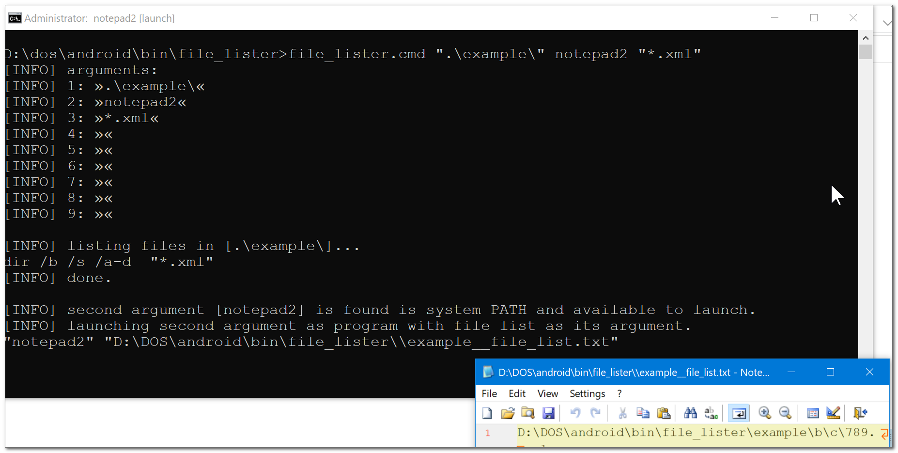

# file_lister

  

[CMD] recursive file list using dir that writes the result into a text file and optionally launches a program with the file list as it argument. faster alternative to slow enumerating folders content using NodeJS or C#. synchronous and simple to use. optional arguments 3-9 are extra filters for dir.
